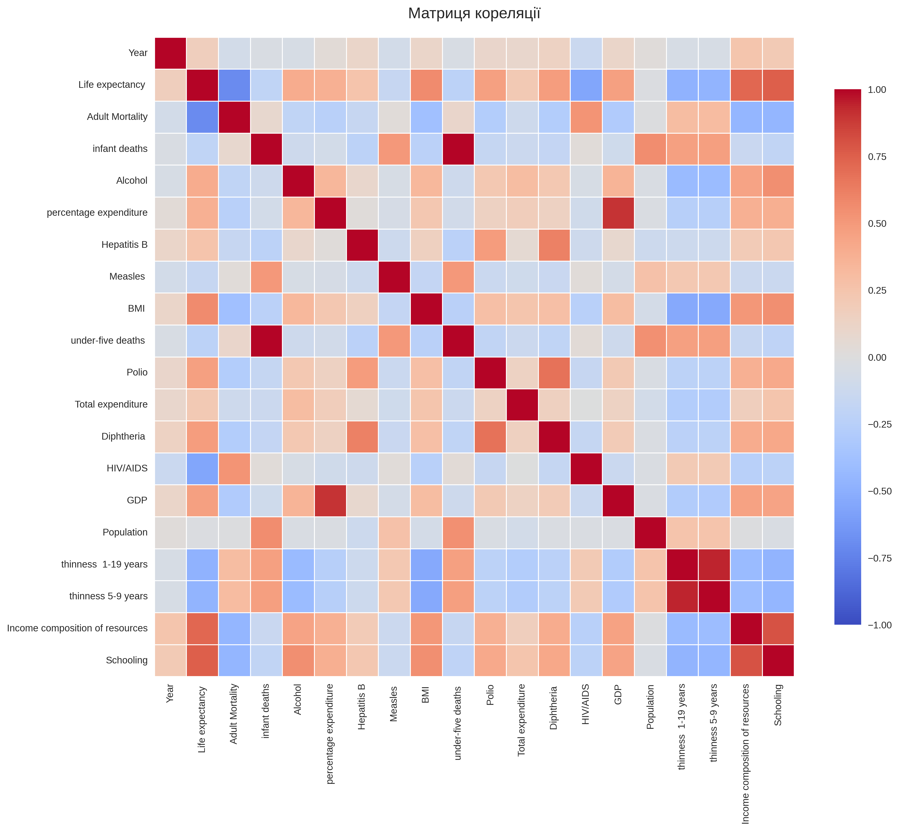

# 📊 Звіт з Лабораторної роботи №2

**Студент:** [Ваше ім'я]  
**Група:** [Ваша група]  
**Дата:** 17 березня 2026  
**Проєкт:** Автоматизація CI/CD конвеєра для "Open Data AI Analytics"

---

## 🎯 Мета роботи
- Налаштувати CI: автоматичний запуск модульних задач (тести/лінт/збірка/перевірки) при `push` та `pull_request`.
- Налаштувати CD: публікація артефактів (логів, звітів, графіків) після успішного CI.
- Навчитись запускати pipeline на GitHub-hosted runners (хмара) та self-hosted runners (локальний ПК).


*(Скріншот успішного підключення Self-Hosted Runner)*

---

## 🧭 Частина A: Налаштування CI для модулів

В рамках цієї роботи було створено автоматизований Pipeline використовуючи GitHub Actions:
Файл налаштувань: `.github/workflows/ci.yml`.

### Тригери (Events)
Конвеєр налаштований на автоматичний запуск:
- при `push` у гілку `main`
- при `pull_request` у гілку `main`
- вручну (`workflow_dispatch`) із можливістю вказати конкретний модуль для перевірки: `data_load`, `data_quality_analysis`, `data_research`, `visualization`, або ж `all`.

### Використання Matrix Strategy
Для забезпечення паралелізму та оптимізації застосована матрична стратегія. Згідно вимог до проєкту, кожен з модулів має перевірятися окремо.
```yaml
strategy:
  fail-fast: false
  matrix:
    module: [data_load, data_quality_analysis, data_research, visualization]
```
Вона дозволяє паралельно запустити 4 віртуальні контейнери (`ubuntu-latest`), кожен з яких перевіряє власний модуль. Якщо модулю "A" потрібні дані, вони завантажуються ізольовано, не зачіпаючи "модуль B". При цьому, якщо тестування `data_research` впаде з помилкою, інші три модулі продовжать виконання (`fail-fast: false`).

---

## 📦 Частина B: CD та робота з артефактами

Наприкінці виконання кожного job-а відбувається завантаження артефактів через Action: `actions/upload-artifact@v4`.
- **Логи:** Усі консольні виводи Python-скриптів (як `stdout`, так і `stderr`) перенаправляються у файл `artifacts/[назва_модуля]/run.log`.
- **Дані/Графіки:** Усі згенеровані модулем візуалізації графіки (`reports/figures/*.png`) завантажуються туди ж разом із логом.
Процес зберігання артефактів виконується навіть якщо попередній запуску модуля завершився помилкою (`if: always()`).

Тепер після завершення CI можна одразу завантажити архів з результатами роботи прямо зі сторінки GitHub Actions:


---

## 💻 Частина C: Self-hosted runner (Локальний агент)

Було налаштовано `self-hosted runner` на локальному комп'ютері під управлінням OS Windows (за допомогою PowerShell). Створено окремий workflow `.github/workflows/ci-selfhosted.yml`, що використовує мітку `runs-on: [self-hosted]`.

Під час запуску виникла проблема з кодуванням `cp1252` при спробі PowerShell вивести в термінал кириличні символи (українська мова) від скрипта Kaggle API логера. Було ухвалене рішення пропускати автоматичне завантаження датасету для локального агента, оскільки в умовах self-hosted сервера ми маємо доступ до локальної файлової системи (`D:\Uni\3Kyrs\open-data-ai-analytics\actions-runner\_work\...\data\raw\`).

### Порівняльна характеристика

| Критерій | GitHub-hosted Runner (`ubuntu-latest`) | Self-hosted Runner (Локальний ПК) |
|----------|----------------------------------------|-----------------------------------|
| **Швидкість** | Потребує ~10-20 секунд на завантаження віртуальної машини з нуля. Всі pip-пакети скачуються заново. | Одразу приступає до роботи (0 секунд на запуск). Python та багато бібліотек вже закешовані локально ОС. |
| **Ресурси** | 2-Core CPU, 7GB RAM. Немає доступу до локальних дисків/баз розробника. | Повний доступ до локальних закритих баз, файлової системи `D:\`, та потужностей GPU локального комп'ютера. |
| **Сек'юрність та Ризики** | Безпечно: повністю ізольоване середовище, яке знищується після обробки завдання. | **Небезпечно:** Будь-який шкідливий код у pull request може бути виконаний локально від імені користувача Windows. |
| **Надійність** | Працює незалежно, підтримується серверами GitHub 24/7. | Runner перестане бути активним (Offline), якщо термінал буде закрито або комп'ютер вимкнеться. |

### Висновок
Для виконання поточних лабораторних задач та роботи з публічними бібліотеками (як-от Kaggle), `GitHub-hosted runner` є значно надійнішим та зручнішим (не виникає проблем із середовищем виконання `UTF-8` vs `cp1252`). Проте використання `Self-hosted runner` є критично важливим, якщо необхідно тренувати моделі, що потребують локального GPU (CUDA) розробника або масивних локальних датасетів, які не можна передати в хмару з питань безпеки чи об'єму.

---
*Статус: Лабораторна робота виконана успішно.*