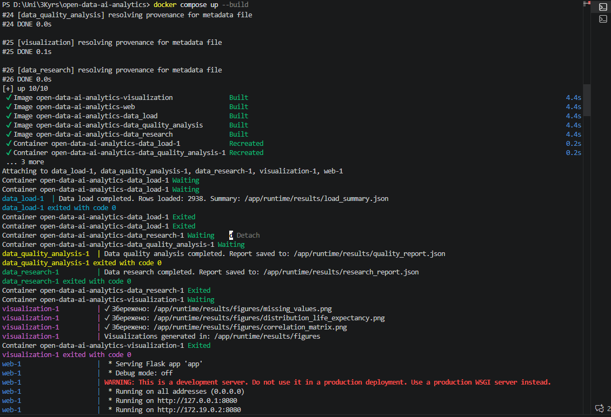
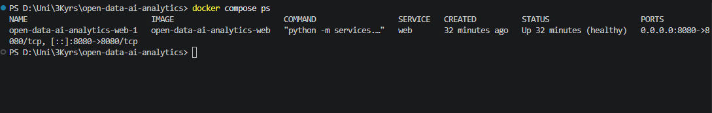
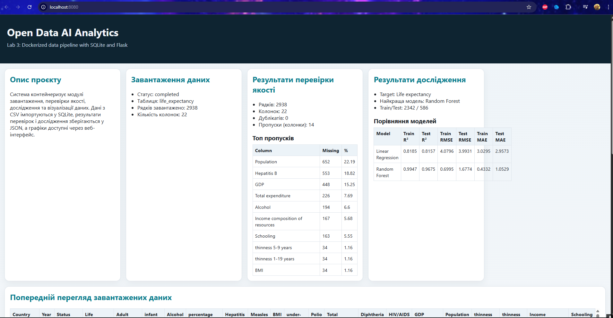
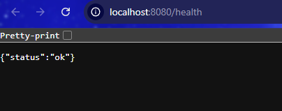

# 📦 Звіт з Лабораторної роботи №3

**Студент:** Гаргай Юрій  
**Група:** ШІ-33  
**Дата:** 11 квітня 2026  
**Проєкт:** Containerization of Open Data AI Analytics

---

## 📌 Зміст

1. Постановка задачі
2. Мета роботи
3. Технології та інструменти
4. Архітектура контейнерного рішення
5. Хід виконання роботи
6. Результати запуску і перевірки
7. Необхідні скріншоти для захисту
8. Аналіз труднощів і способи вирішення
9. Відповіді на контрольні питання
10. Висновки

---

## 🎯 Постановка задачі

Необхідно контейнеризувати модулі проєкту з аналізу відкритих даних та забезпечити запуск усієї системи однією командою Docker Compose. Система повинна включати окремі сервіси для завантаження даних, аналізу якості, дослідження, візуалізації та веб-представлення результатів.

---

## 🎯 Мета роботи

1. Освоїти практичну контейнеризацію багатомодульного Python-проєкту.
2. Розділити застосунок на окремі сервіси з чіткими ролями.
3. Налаштувати обмін результатами між контейнерами через SQLite і спільні томи.
4. Реалізувати веб-інтерфейс для демонстрації результатів аналізу.
5. Забезпечити стабільний локальний запуск через Docker Workspace.

---

## 🛠️ Технології та інструменти

- Docker
- Docker Compose
- Python 3.11
- Flask
- SQLite
- Pandas, NumPy, scikit-learn
- Matplotlib, Seaborn

---

## 🧱 Архітектура контейнерного рішення

### Сервіси системи

1. **data_load**
   Читає CSV файл, створює таблицю у SQLite та записує дані в БД.

2. **data_quality_analysis**
   Виконує перевірку якості даних, формує звіт quality_report.json.

3. **data_research**
   Виконує базове дослідження та моделювання, формує research_report.json.

4. **visualization**
   Будує графіки за результатами аналізу та зберігає PNG файли.

5. **web**
   Надає веб-інтерфейс для перегляду даних, звітів та графіків.

### Логіка обміну даними

1. CSV файл передається в data_load.
2. Data_load формує SQLite базу.
3. Data_quality_analysis і data_research читають дані з SQLite.
4. Visualization читає результати звітів і генерує графіки.
5. Web сервіс відображає результати для користувача через браузер.

### Персистентність і взаємодія

1. Використано спільний том runtime для БД та результатів.
2. Використано Docker network analytics-network.
3. Залежності між сервісами задано через depends_on.

---

## 🧪 Хід виконання роботи

### Крок 1. Контейнеризація модулів

Створено окремі Dockerfile для кожного сервісу:

- services/data_load/Dockerfile
- services/data_quality_analysis/Dockerfile
- services/data_research/Dockerfile
- services/visualization/Dockerfile
- services/web/Dockerfile

Кожен контейнер використовує базовий образ python:3.11-slim, встановлює залежності з requirements.txt та запускає відповідний модуль.

### Крок 2. Інтеграція через Compose

Створено compose.yaml, у якому описано:

1. Усі п’ять сервісів.
2. Налаштування середовища через змінні.
3. Спільний том runtime.
4. Публікацію веб-порту 8080.
5. Healthcheck для web сервісу.

### Крок 3. Реалізація CSV -> SQLite

Сервіс data_load виконує:

1. Завантаження CSV.
2. Створення SQLite БД runtime/db/life_expectancy.db.
3. Запис таблиці life_expectancy.
4. Формування load_summary.json.

### Крок 4. Формування аналітичних звітів

Сервіс data_quality_analysis формує quality_report.json з:

1. Кількістю пропусків.
2. Дублікатами.
3. Інформацією про типи даних.
4. Узагальненими метриками якості.

Сервіс data_research формує research_report.json з:

1. Базовими статистиками.
2. Метриками моделей.
3. Порівнянням результатів.
4. Топ-кореляціями та важливістю ознак.

### Крок 5. Візуалізація

Сервіс visualization зберігає щонайменше 2 графіки у PNG форматі.

Реально сформовані файли:

1. missing_values.png
2. distribution_life_expectancy.png
3. correlation_matrix.png

### Крок 6. Веб-інтерфейс

Сервіс web (Flask) надає:

1. Головну сторінку з описом проєкту.
2. Відображення summary завантаження даних.
3. Відображення quality_report.
4. Відображення research_report.
5. Відображення візуалізацій.
6. Endpoint перевірки стану: /health.

---

## ✅ Результати запуску і перевірки

### Основний запуск

```bash
docker compose up --build -d
```

### Перевірка сервісів

```bash
docker compose ps -a
```

Отримано коректний сценарій:

1. Data_load завершився з кодом 0.
2. Data_quality_analysis завершився з кодом 0.
3. Data_research завершився з кодом 0.
4. Visualization завершився з кодом 0.
5. Web сервіс перейшов у стан Up (healthy).

### Перевірка endpoint

```bash
http://localhost:8080/health
```

Результат:

```json
{"status":"ok"}
```

### Перевірка артефактів

Після виконання сформовано:

1. runtime/db/life_expectancy.db
2. runtime/results/load_summary.json
3. runtime/results/quality_report.json
4. runtime/results/research_report.json
5. runtime/results/figures/*.png

---

## 📸 Скріншоти виконання лабораторної

### Рисунок 1. Запуск та побудова контейнерів

Команда: docker compose up --build



### Рисунок 2. Статус сервісу web після завершення пайплайна

Команда: docker compose ps

На скріні видно, що web-контейнер працює у статусі healthy.



### Рисунок 3. Головна сторінка веб-інтерфейсу з результатами аналізу

Адреса: http://localhost:8080



### Рисунок 4. Перевірка health endpoint

Адреса: http://localhost:8080/health



---

## ⚠️ Аналіз труднощів і способи вирішення

### Проблема 1
Падіння data_research через NaN у фічах для LinearRegression.

**Рішення:**
Додано обробку inf/NaN перед train_test_split і навчанням моделей.

### Проблема 2
Побудова графіків у headless-середовищі Docker.

**Рішення:**
Переведено matplotlib у режим Agg і додано керування показом графіків через PLOT_SHOW.

### Проблема 3
Серіалізація деяких типів у JSON звіті якості.

**Рішення:**
Явне перетворення dtype у рядковий формат перед записом у JSON.

### Проблема 4
Іноді недоступний Docker daemon на Windows.

**Рішення:**
Перед запуском перевіряти docker info і за потреби перезапускати Docker Desktop.

---

## ❓ Відповіді на контрольні питання

1. **Що таке контейнеризація і чим вона відрізняється від віртуалізації?**  
   Контейнеризація ізолює застосунки на рівні ОС і використовує спільне ядро. Віртуалізація запускає повноцінні окремі ОС у віртуальних машинах.

2. **Для чого використовується Dockerfile?**  
   Для опису процесу збірки Docker образу.

3. **Для чого використовується Docker Compose?**  
   Для декларативного запуску багатосервісного застосунку однією командою.

4. **Що таке Docker image і Docker container?**  
   Image це шаблон, container це запущений екземпляр цього шаблону.

5. **Для чого потрібні volumes?**  
   Для персистентного зберігання даних і обміну файлами між контейнерами.

6. **Для чого потрібні networks?**  
   Для ізоляції мережевого трафіку і взаємодії сервісів за іменами.

7. **Як організувати взаємодію між контейнерами?**  
   Через спільну мережу, томи, БД і залежності запуску.

8. **Які переваги дає контейнеризація для DevOps-проєктів?**  
   Відтворюваність оточення, швидке розгортання, простіше масштабування та автоматизація CI/CD.

9. **Чому веб-інтерфейс варто виділяти в окремий сервіс?**  
   Це дає розділення відповідальностей, незалежне масштабування і простіше обслуговування.

10. **Які проблеми можуть виникати при запуску кількох контейнерів одночасно?**  
    Конфлікти портів, помилки залежностей, відсутність healthcheck, проблеми мережевої взаємодії та доступу до спільних ресурсів.

---

## 🏁 Висновки

У лабораторній роботі реалізовано повноцінну контейнеризацію проєкту Open Data AI Analytics.

Досягнуті результати:

1. Контейнеризовано всі обов’язкові сервіси.
2. Налаштовано централізований запуск через compose.yaml.
3. Реалізовано обмін даними через SQLite і shared volumes.
4. Налаштовано веб-інтерфейс для демонстрації результатів.
5. Підтверджено коректну роботу системи через healthcheck і runtime артефакти.

Таким чином, всі основні вимоги Lab 3 виконано в повному обсязі.
